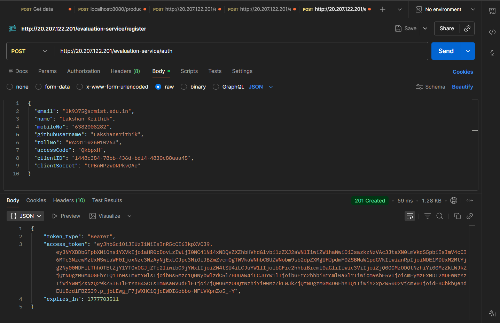
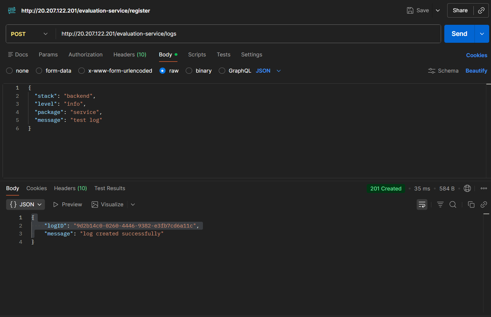
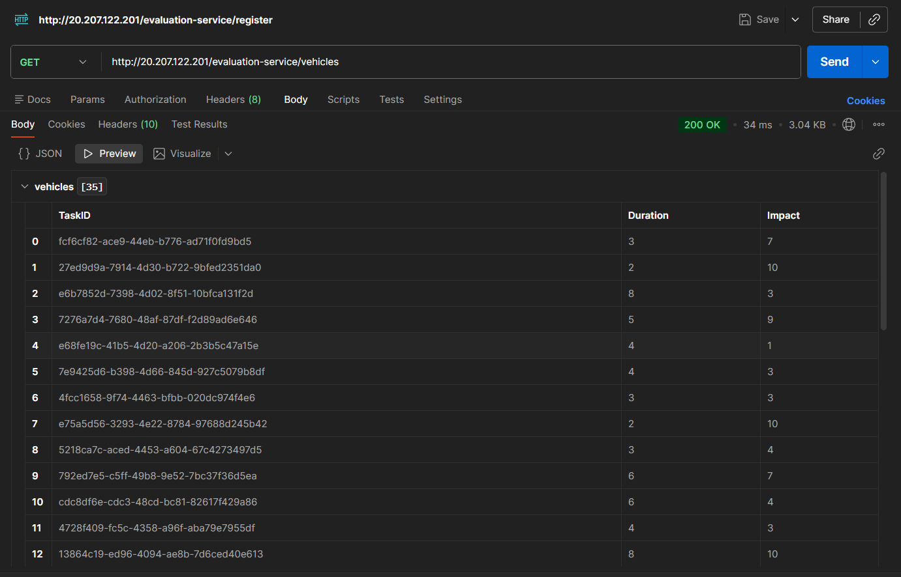
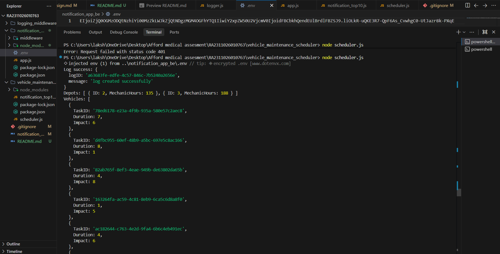
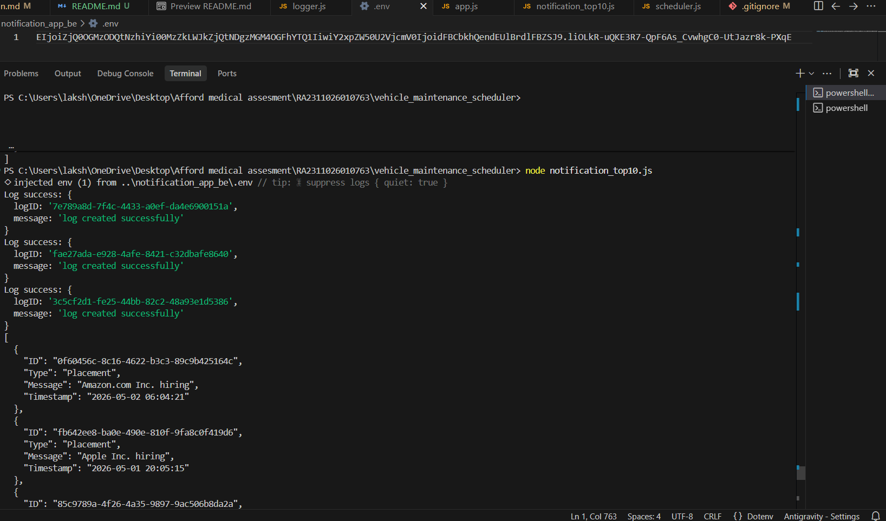

# Backend Evaluation Submission

This repository contains the implementation for the backend track of the evaluation.

---

## Overview

The project includes:

* Logging Middleware for capturing and sending logs to a protected API
* Vehicle Maintenance Scheduler using optimization logic
* Notification Priority System for selecting top notifications based on priority and recency
* Supporting API integrations and screenshots for validation

---

## Features

### Authentication

* Generated access token using the provided authentication API
* Used token for all protected API requests

### Logging Middleware

* Implemented reusable logging function:

```js
Log(stack, level, package, message)
```

* Sends logs to the evaluation logging API
* Integrated across services, scheduler, and notification processing

### Vehicle Maintenance Scheduler

* Fetches depots and vehicle data from APIs
* Applies greedy optimization using impact-to-duration ratio
* Maximizes total impact within available mechanic hours
* Outputs:

  * Selected tasks per depot
  * Total impact
  * Time utilized

### Notification Priority System

* Fetches notifications from API
* Applies priority order:

  * Placement > Result > Event
* Sorts by priority and timestamp (recency)
* Returns top 10 notifications

---

## Screenshots

### Authentication (Token Generation)
Shows successful generation of access token.


---

### Logging Middleware API
Shows successful log creation using protected API.


---

### Vehicles API Data
Shows fetched vehicle data including duration and impact.


---

### Vehicle Maintenance Scheduler Output
Shows optimized task selection for each depot.


---

### Notification Priority Output
Shows top 10 notifications sorted by priority and recency.


---

## Design Documentation

Detailed system design is available in:

notification_system_design.md

##

---

## Status

* Logging Middleware implemented
* Vehicle Maintenance Scheduler completed
* Notification Priority System completed
* Required screenshots included
